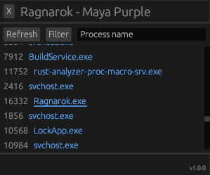
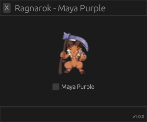

<div align="center">


</div>

<div align="center">
  <picture>
    
  </picture>
</div>

<h4 align="center">
  Ragnarok Online
</h4>

<p align="center">
  Enable its user to detect hidden players during combat without having any item, using single-byte patching to achieve the Maya Purple Card effect on the game.
</p>

<div align="center">
  <picture>
    
  </picture>
</div>

### 📖 About

Ragnarok Online is a massively multiplayer online role-playing game (MMORPG) created by Gravity. It was released so many years ago while it still has a massive community and many crowded private servers from people worldwide.

This external cheat provides an effect when activated giving the player much more advantages on Player vs Player. The question is, why not have advantages for **FREE**? With a single-byte patching, we apply this effect enabling its user to detect hidden players during combat. We could also remove delays from the skills (NDL/NoDelay) and many more shenanigans inside this game, but it's excessively overpowered.

<div align="center">
  <picture>
    
  </picture>

  <picture>
    
  </picture>
</div>

This PoC does not work on servers using Gepard Shield because they have memory integrity checks and place hooks in many places to avoid those kinds of stuff. If you want to bypass it, you could take a look at [GepardBypass](https://github.com/Cjaker/GepardBypass) and after it, just do the same thing I did here, patch those bytes!
A little tip for those who want to keep going with Gepard: Go internal with DLL Hijacking, Indirect syscalls and Hooking via Vectored Exception Handler (VEH).

### 📖 How to find the right memory address

If you have [Cheat Engine](https://www.cheatengine.org/) or any other memory-scanning application, you can find this address. The easiest way to find this memory address for the *first time* is to setup one server on your machine with the same hexed version you want or choose any Ragnarok online server without Gepard and equip a Maya Purple card and remove it a few times while keeping scanning the memory for the changes until finding it. But now, that we already know it's only one change from 0x84 to 0x85 and we found the pattern for scanning it, it gonna be lightning fast.

Cheat Engine > Attach to Process > Memory View > Search by pattern

```
0F 84 ?? 00 00 00 83 C0 14 3B C1 75 ED 80 BE A0
```

Or using the direct address - valid for 2018 hexed servers

```
0x00A9C3A7
```

Patch it from 0x84 to 0x85 ¯\_(ツ)_/¯


### 🖥️ Development

```
cargo run
```
or

```
cargo build --release
```

Go to the target/ folder and open the generated .exe **as Administrator**

### 🏴‍☠️ Credits

Got some resources and studied from:
- [DLL Crab](https://github.com/forksarchive/dll-crab/) - UI with egui
- [GuidedHacking](https://guidedhacking.com/) and [UnknownCheats](https://www.unknowncheats.me/)
- [EzMem](https://github.com/AlexanderHeim/ezmem)
- Thanks rayzera-#7665
- [Vitor Torres](https://github.com/vtorres/) 🤖